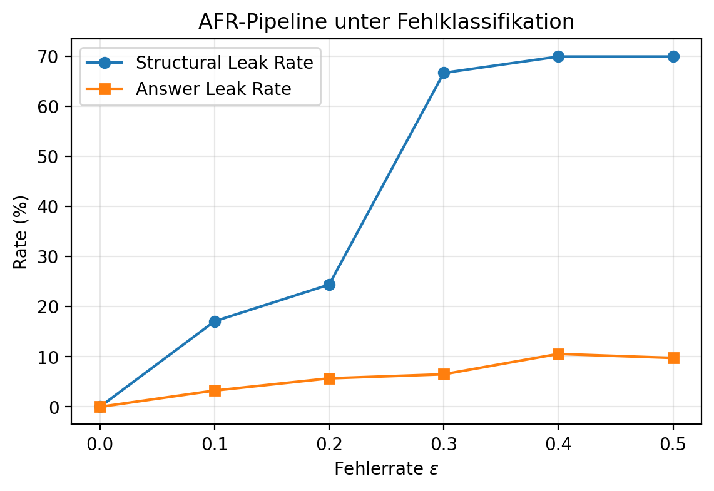
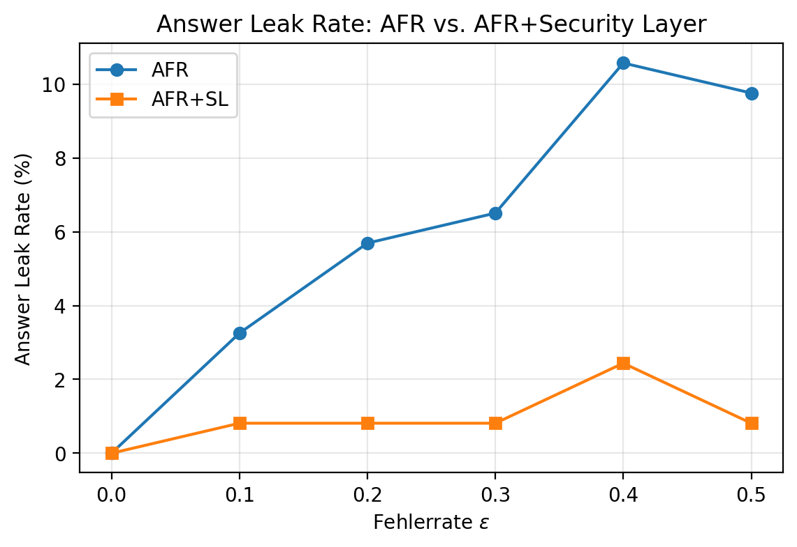
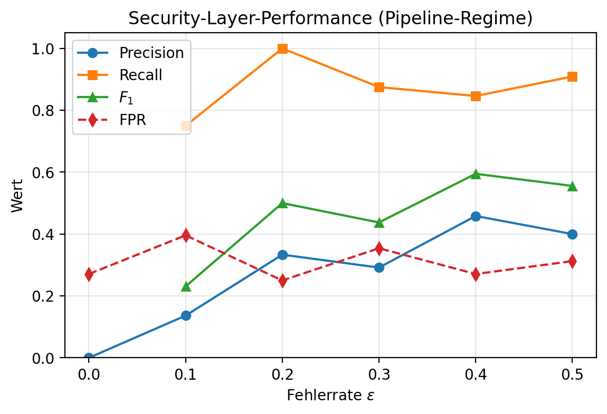
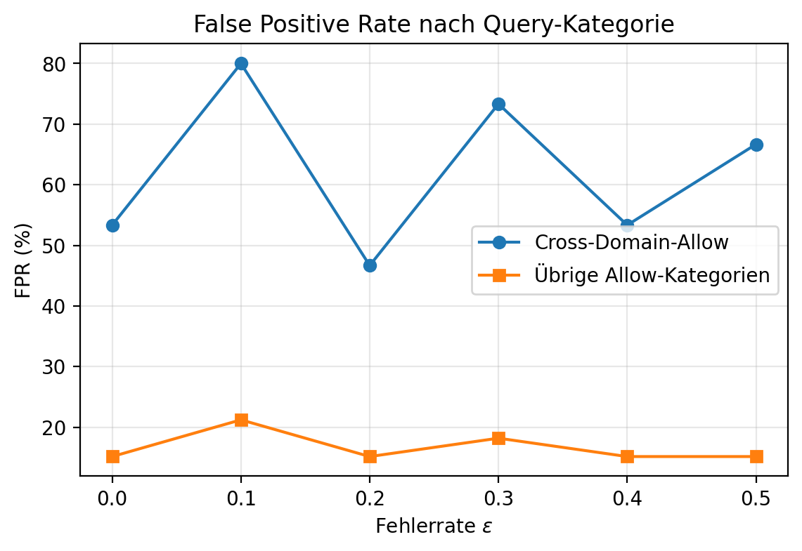
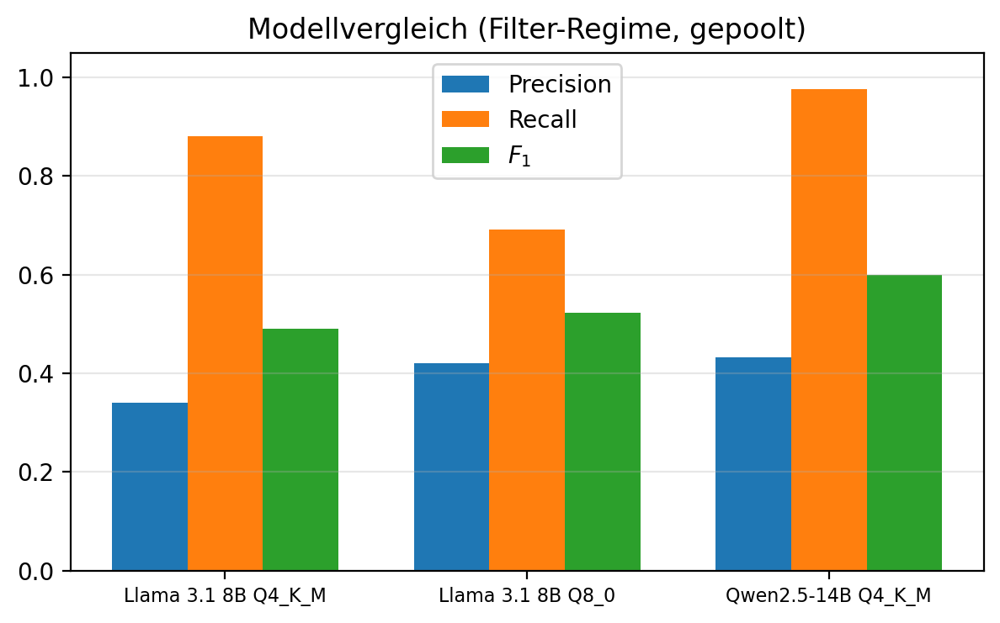

# Thesis-Zahlen: Evaluationsreport

Automatisch erzeugt aus den kanonischen Datenquellen (`evaluation/results/misclassification`, JSONs). 

## A1 — tab:afr-stresstest (D6, gepoolt über 3 Seeds)

| $\varepsilon$ | Fehlklassifizierte Chunks (Ø) | Structural Leak Rate | Answer Leak Rate |
|---:|---:|---:|---:|
| 0,0 | 0,0 | 0,0 % (0/123) | 0,0 % (0/123) |
| 0,1 | 1,7 | 17,1 % (21/123) | 3,3 % (4/123) |
| 0,2 | 2,3 | 24,4 % (30/123) | 5,7 % (7/123) |
| 0,3 | 4,0 | 66,7 % (82/123) | 6,5 % (8/123) |
| 0,4 | 5,3 | 69,9 % (86/123) | 10,6 % (13/123) |
| 0,5 | 5,3 | 69,9 % (86/123) | 9,8 % (12/123) |

### A1b — Answer Leaks je Seed (Seed-Schiefe)

| $\varepsilon$ | Seed 42 | Seed 123 | Seed 777 |
|---:|---:|---:|---:|
| 0,0 | 0 | 0 | 0 |
| 0,1 | 4 | 0 | 0 |
| 0,2 | 7 | 0 | 0 |
| 0,3 | 4 | 2 | 2 |
| 0,4 | 7 | 3 | 3 |
| 0,5 | 4 | 4 | 4 |

## A2 — tab:afr-sl-vergleich (Answer Leaks, gepoolt)

| $\varepsilon$ | AFR | AFR+SL | Leak-Reduktion | SL Blocks (Ø) |
|---:|---:|---:|---:|---:|
| 0,0 | 0,0 % (0/123) | 0,0 % (0/123) | — | 16,67 |
| 0,1 | 3,3 % (4/123) | 0,8 % (1/123) | 75,0 % | 20,67 |
| 0,2 | 5,7 % (7/123) | 0,8 % (1/123) | 85,7 % | 18,33 |
| 0,3 | 6,5 % (8/123) | 0,8 % (1/123) | 87,5 % | 21,33 |
| 0,4 | 10,6 % (13/123) | 2,4 % (3/123) | 76,9 % | 18,67 |
| 0,5 | 9,8 % (12/123) | 0,8 % (1/123) | 91,7 % | 21,00 |

## A3 — tab:sl-performance (Pipeline-Regime; Verdict D6_SL × Leak-GT D6)

Gepoolte Counts über drei Seeds; Metriken aus gepoolten Häufigkeiten.

| $\varepsilon$ | TP | FP | FN | TN | Prec. | Recall | $F_1$ | FPR |
|---:|---:|---:|---:|---:|---:|---:|---:|---:|
| 0,0 | 0 (0,00) | 13 (4,33) | 0 (0,00) | 35 (11,67) | 0,000 | — | — | 0,271 |
| 0,1 | 3 (1,00) | 19 (6,33) | 1 (0,33) | 29 (9,67) | 0,136 | 0,750 | 0,231 | 0,396 |
| 0,2 | 6 (2,00) | 12 (4,00) | 0 (0,00) | 36 (12,00) | 0,333 | 1,000 | 0,500 | 0,250 |
| 0,3 | 7 (2,33) | 17 (5,67) | 1 (0,33) | 31 (10,33) | 0,292 | 0,875 | 0,438 | 0,354 |
| 0,4 | 11 (3,67) | 13 (4,33) | 2 (0,67) | 35 (11,67) | 0,458 | 0,846 | 0,595 | 0,271 |
| 0,5 | 10 (3,33) | 15 (5,00) | 1 (0,33) | 33 (11,00) | 0,400 | 0,909 | 0,556 | 0,312 |
| **Pool** | 37 | 89 | 5 | 199 | 0,294 | 0,881 | 0,440 | |

## A4 — tab:fpr-crossdomain (je Fehlerrate, gepoolt über Seeds)

| $\varepsilon$ | Cross-Domain FP | FPR Cross-Domain | Rest FP | FPR Rest |
|---:|---:|---:|---:|---:|
| 0,0 | 8/15 | 53,3 % | 5/33 | 15,2 % |
| 0,1 | 12/15 | 80,0 % | 7/33 | 21,2 % |
| 0,2 | 7/15 | 46,7 % | 5/33 | 15,2 % |
| 0,3 | 11/15 | 73,3 % | 6/33 | 18,2 % |
| 0,4 | 8/15 | 53,3 % | 5/33 | 15,2 % |
| 0,5 | 10/15 | 66,7 % | 5/33 | 15,2 % |

Gepoolt über alle Fehlerraten: Cross-Domain 56/90 = 62,2 %; übrige Allow 33/198 = 16,7 %.

## A5 — tab:fp-analyse (FP nach violated_rule, gepoolt)

| Verstoßtyp | Anzahl | Anteil |
|---|---:|---:|
| `sensitivity` | 66 | 74,2 % |
| `domain` | 19 | 21,3 % |
| `forbidden_content` | 4 | 4,5 % |
| **Gesamt** | 89 | 100,0 % |

## A6 — Latenz-Overhead (Pipeline)

- D6 (AFR): 40997 ms
- D6_SL (AFR+SL): 49989 ms
- Overhead: 8991 ms = 21,9 %

## B — Modellvergleich (Filter-Regime, Rerun)

| Metrik | Llama 3.1 8B Q4_K_M | Llama 3.1 8B Q8_0 | Qwen2.5-14B Q4_K_M |
|---|---:|---:|---:|
| TP (gesamt) | 37 | 29 | 41 |
| FP (gesamt) | 72 | 40 | 54 |
| FN (gesamt) | 5 | 13 | 1 |
| TN (gesamt) | 216 | 248 | 234 |
| Precision | 0,339 | 0,420 | 0,432 |
| Recall | 0,881 | 0,690 | 0,976 |
| $F_1$ | 0,490 | 0,523 | 0,599 |
| Cross-Domain-FPR | 52,2 % | 37,8 % | 53,3 % |
| Rest-FPR | 12,6 % | 3,0 % | 3,0 % |
| Ø SL-Latenz | 26,8 s | 33,3 s | 50,8 s |

### FP nach violated_rule je Modell

| Verstoßtyp | Llama 3.1 8B Q4_K_M | Llama 3.1 8B Q8_0 | Qwen2.5-14B Q4_K_M |
|---|---:|---:|---:|
| `domain` | 38 | 14 | 13 |
| `forbidden_content` | 2 | 1 | 13 |
| `sensitivity` | 32 | 25 | 28 |

### Recall je Fehlerrate

| Modell | $\varepsilon$=0,0 | $\varepsilon$=0,1 | $\varepsilon$=0,2 | $\varepsilon$=0,3 | $\varepsilon$=0,4 | $\varepsilon$=0,5 |
|---|---:|---:|---:|---:|---:|---:|
| Llama 3.1 8B Q4_K_M | 0,000 | 0,750 | 0,667 | 0,875 | 0,923 | 1,000 |
| Llama 3.1 8B Q8_0 | 0,000 | 0,500 | 0,500 | 0,750 | 0,692 | 0,818 |
| Qwen2.5-14B Q4_K_M | 0,000 | 1,000 | 1,000 | 1,000 | 1,000 | 0,909 |

## Grafiken

### AFR-Pipeline: Leak-Raten über $\varepsilon$

### Answer Leak Rate: AFR vs. AFR+SL

### Security-Layer-Metriken über $\varepsilon$

### FPR nach Query-Kategorie

### Modellvergleich: Precision, Recall, $F_1$

